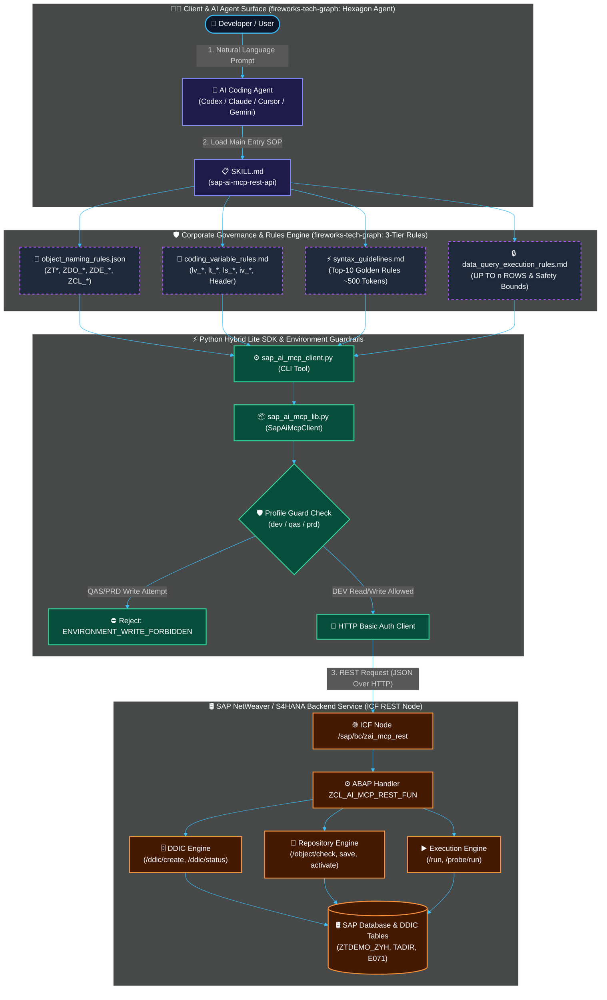
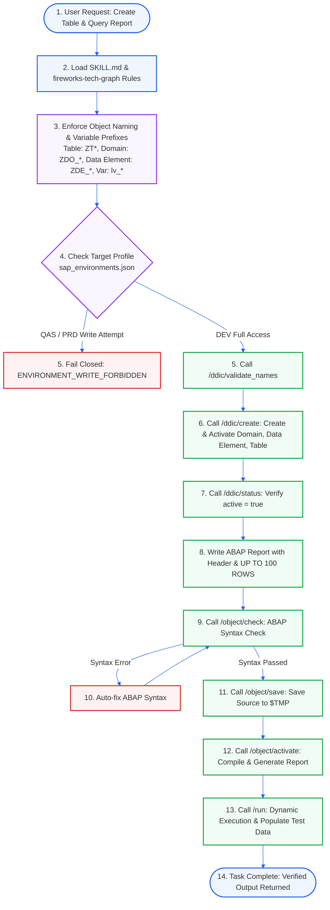

# SAP AI MCP REST API (Skill & SDK)

> **为 AI Agent (Codex, Claude Code, Cursor, Gemini) 打造的现代化 SAP NetWeaver / S/4HANA 全生命周期开发、DDIC 建模与自动化运维 Skill 引擎。**

[](https://www.sap.com)
[](https://www.python.org)
[]()
[](https://github.com/yizhiyanhua-ai/fireworks-tech-graph)
[]()

[English Document](README.md) | [中文说明文档](README.zh.md)

---

## 概述 (Overview)

`sap-ai-mcp-rest-api` 是一个专为 AI Coding Agent 设计的专业级 SAP 开发交互 Skill 库。它通过部署在 SAP 系统的原生 HTTP REST 服务节点 (`/sap/bc/zai_mcp_rest`) 以及独立的 ABAP 处理类 (`ZCL_AI_MCP_REST_FUN.abap`)，配合轻量级 Python Hybrid SDK，实现了从**自然语言需求描述 ➔ 企业级命名与语法规范校验 ➔ DDIC 模型创建激活 ➔ ABAP 程序编写/检查/保存/激活 ➔ 动态执行验证**的全流程闭环。

---

## 架构与技术原理 (Architecture & Technical Principles)

> 架构图与工作流图基于 [fireworks-tech-graph](https://github.com/yizhiyanhua-ai/fireworks-tech-graph) 的标准语义形状词汇表（六边形 Agent 编排器、圆柱体存储、正交零碰撞布线、暗黑玻璃态美学）设计渲染。

### 1. 系统整体架构图 (System Architecture Diagram - Glassmorphism Style)



---

### 2. 执行工作流程图 (Workflow Flowchart - Quality Gate Pipeline)



---

## 核心功能与技术亮点 (Core Features)

1. **数据字典 (DDIC) 全生命周期自动化**：
   * 支持一键校验、批量创建与激活 **Domain (域)**、**Data Element (数据元素)**、**Transparent Table (透明表)** 及 **Structure (结构体)**。
   * 自动维护字段约束、主键标记、文本域描述及包 (`$TMP` / Workbench) 挂载。

2. **Repository 存储库源码控制**：
   * 原生支持 Report 程序、Global Class 类、Function Module 函数模块、Dynpro 屏幕、Message Class 消息类及 Textpool 文本池的远程读取、语法检查 (`/object/check`)、增量保存 (`/object/save`) 与生成激活 (`/object/activate`)。

3. **多环境安全防线 (Multi-Environment Guardrails)**：
   * 内置 `dev` (开发环境 Client 100/400 读写)、`qas` (测试环境 Client 200 受控)、`prd` (生产环境 Client 800 严格只读/故障诊断) 配置文件。
   * SDK 层在发起 HTTP 请求前执行客户端防线检查，对非 `allow_write` 环境自动阻断一切写操作。

4. **三层企业级规范控制机制 (`rules/` & `templates/`)**：
   * **对象命名规则** (`object_naming_rules.json`)：自动匹配企业级前缀 (如 `ZT*`, `ZDO_*`, `ZDE_*`, `ZCL_*`)。
   * **变量与 Header 规范** (`coding_variable_rules.md`)：匈牙利命名法 (`lv_`, `lt_`, `ls_`, `iv_`) 与标准 Header 必须要求。
   * **高频语法黄金准则** (`syntax_guidelines.md`)：常驻 ~500 Tokens 轻量速查卡，结合大容量按需目录索引（经典语法 + S/4HANA ABAP 7.5+ 新特性指南）。
   * **数据查询与安全** (`data_query_execution_rules.md`)：强制 `UP TO n ROWS` 分页与探针安全界限。

5. **标准模板库 (`templates/`)**：
   * 预置标准 ABAP Header 注释模板 (`abap_header.txt`) 与透明表必备审计字段模板 (`table_audit_fields.json`)。

---

## 目录结构 (Directory Structure)

```text
abap-mcp-api/
├── SKILL.md                       # AI Agent Skill 主入口规范
├── README.md                      # 英文说明文档
├── README.zh.md                   # 中文说明文档 (本文件)
├── ZCL_AI_MCP_REST_FUN.abap       # Deployed SAP NetWeaver REST Handler Class (9,400+ 行)
├── config/
│   ├── sap_environments.json      # 本地环境配置文件 (DEV, QAS, PRD Profiles)
│   └── sap_environments.json.example # 安全公开配置示范模板
├── rules/                         # 企业规范与语法知识库
│   ├── object_naming_rules.json   # SAP 对象命名模式与模块前缀定义
│   ├── coding_variable_rules.md   # 变量命名前缀与代码结构规范
│   ├── syntax_guidelines.md       # 高频语法黄金准则速查卡 (~500 Tokens)
│   ├── data_query_execution_rules.md # Open SQL 查询限制与安全规则
│   ├── abap_syntax_guide_classic.md  # 经典 ABAP 基础语法指南 (7.1 万字备查库)
│   └── abap_syntax_guide_s4hana.md   # ABAP 7.5+ / S4HANA 新语法指南 (7.8 万字备查库)
├── templates/                     # 开发模板
│   ├── abap_header.txt            # 标准程序/类 Header 注释模板
│   └── table_audit_fields.json    # 透明表必选审计字段模板
├── scripts/                       # Python SDK 驱动客户端
│   ├── sap_ai_mcp_client.py       # 命令行 CLI 工具
│   ├── sap_ai_mcp_lib.py          # Core SDK API 客户端库
│   ├── sap_ai_mcp_call.py         # HTTP 底层封装与 Base URL 检查
│   └── sap_ai_mcp_debug.py        # 调试工具
├── references/                    # SOP 操作 Playbooks 与端点文档
│   ├── policy.md                  # 访问边界与安全策略
│   ├── endpoints.md               # REST 端点列表与 PATH_INFO 路由
│   ├── calling.md                 # SDK 调用契约与编码规则
│   ├── environments.md            # 多环境配置说明
│   ├── playbook-ddic.md           # DDIC 操作 SOP
│   ├── playbook-report.md         # Report 操作 SOP
│   ├── playbook-class.md          # Class 操作 SOP
│   └── playbook-function-module.md # Function Module 操作 SOP
└── tests/                         # 单元测试与契约测试
```

---

## 快速入门 (Quickstart)

### 1. SAP 服务端部署 (SAP Backend Setup)
1. 在 SAP 系统 (SE24) 中创建类 `ZCL_AI_MCP_REST_FUN`，将 [ZCL_AI_MCP_REST_FUN.abap](file:///c:/Users/37145/Desktop/abap-mcp-api/ZCL_AI_MCP_REST_FUN.abap) 的源码导入并激活。
2. 在 SICF 事务码中激活 REST 节点服务：`/sap/bc/zai_mcp_rest`，处理类绑定 `ZCL_AI_MCP_REST_FUN`。

### 2. 客户端环境配置 (Client Setup)
复制范例配置文件：
```bash
cp config/sap_environments.json.example config/sap_environments.json
```
在 `config/sap_environments.json` 或环境变量中填入目标 SAP 系统的 `base_url` 与认证凭据 (`user` / `password` 或 `SAP_DEV_USER` / `SAP_DEV_PASSWORD`)。

### 3. CLI 与 Python SDK 使用

通过命令行调用 SDK：
```bash
python scripts/sap_ai_mcp_client.py --profile dev ddic_status --domains '[{"name":"ZDO_ZYH_ID"}]'
```

Python 代码调用：
```python
from sap_ai_mcp_lib import SapAiMcpClient

client = SapAiMcpClient(profile='dev')

# 1. 验证与创建数据字典 (DDIC)
res = client.call('ddic_create', {
    "package": "$TMP",
    "domains": [{"name": "ZDO_DEMO_ID", "data_type": "CHAR", "length": 10}],
    "data_elements": [{"name": "ZDE_DEMO_ID", "domain": "ZDO_DEMO_ID"}],
    "tables": [{"name": "ZTDEMO_TABLE", "fields": [{"name": "DEMO_ID", "data_element": "ZDE_DEMO_ID", "key_flag": True}]}]
})

# 2. 检查、保存并激活程序
client.call('object_check', {"object_type": "PROG", "object_name": "ZRP_DEMO", "source_code": abap_source})
client.call('object_save', {"object_type": "PROG", "object_name": "ZRP_DEMO", "source_code": abap_source})
client.call('object_activate', {"object_type": "PROG", "object_name": "ZRP_DEMO"})
```

---

## 致谢 (Acknowledgements)

本说明文档中的架构图与工作流程图设计，严格遵循了 [fireworks-tech-graph](https://github.com/yizhiyanhua-ai/fireworks-tech-graph) Skill 的图形表达规范、语义形状词汇表与工程美学契约。

---

## License

MIT © 2026 zyhcs / sap-ai-mcp-rest-api
