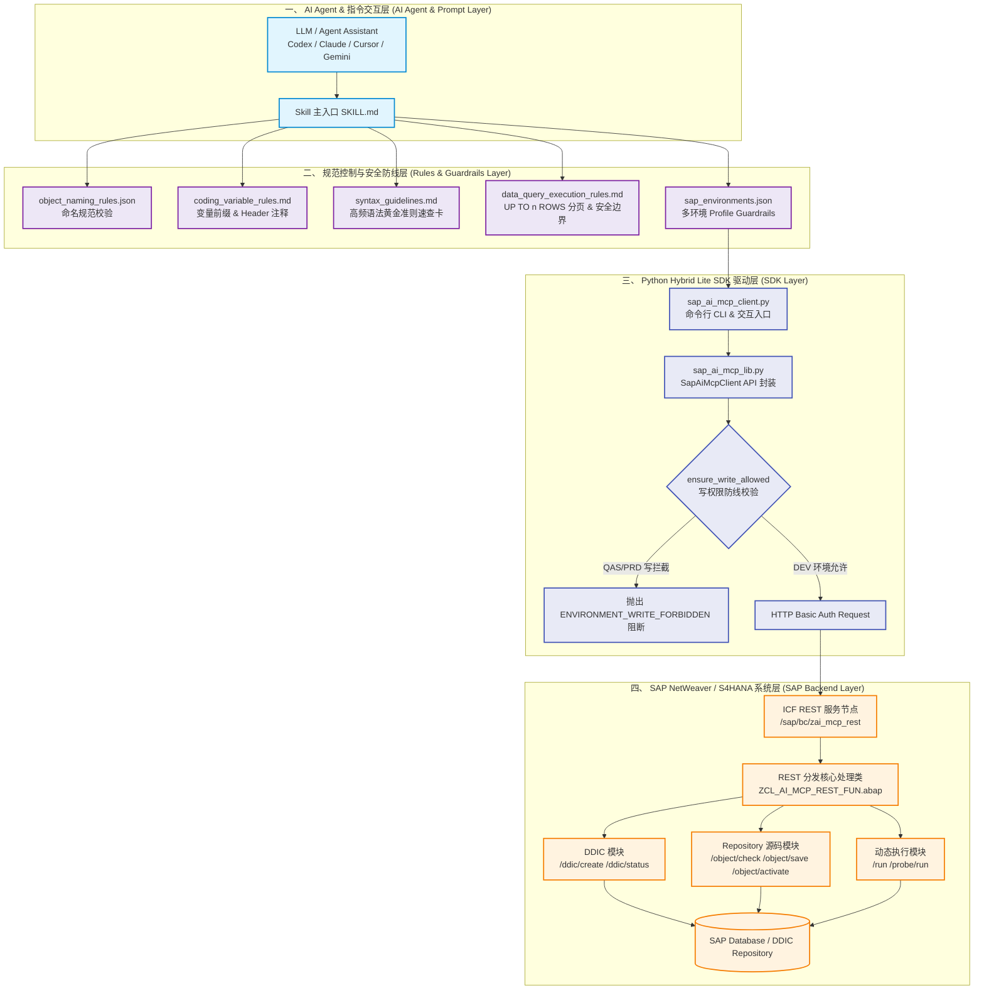

# 01. 系统整体架构与 4 层模型设计

`sap-ai-mcp-rest-api` 采用分层解耦的现代化 Agent 架构体系，分为 **AI Agent 交互层**、**规范控制与安全防线层**、**Python Hybrid SDK 驱动层** 和 **SAP Backend 后端系统层**。

---

## 系统 4 层架构全景图

---

## 4 层模型核心职责拆解

### 1. 第一层：AI Agent 交互层
* **SKILL.md** 充当大脑的 SOP 指南，定义了 Agent 在遇到不同 SAP 任务时的触发词、思考路径、Playbook 路由和强约束规范。

### 2. 第二层：规范控制与安全防线层
* 在代码生成前，通过 `rules/` 体系约束对象命名 (`object_naming_rules.json`)、变量前缀与 Header (`coding_variable_rules.md`)、高频语法 (`syntax_guidelines.md`) 及数据查询分页限制 (`data_query_execution_rules.md`)。

### 3. 第三层：Python Hybrid Lite SDK 驱动层
* **`sap_ai_mcp_client.py` & `sap_ai_mcp_lib.py`**：负责读取环境配置文件 `config/sap_environments.json`，在发送 HTTP 请求前拦截非 `allow_write` 环境的写请求。

### 4. 第四层：SAP 后端 REST 引擎层
* 部署在 ICF 服务节点 `/sap/bc/zai_mcp_rest` 上的 ABAP 类 **`ZCL_AI_MCP_REST_FUN`**（9,400+ 行），负责解析 HTTP `PATH_INFO` 路由并调用 SAP 底层 DDIC 与 Repository 函数完成对象的校验、保存、生成、激活与执行。
