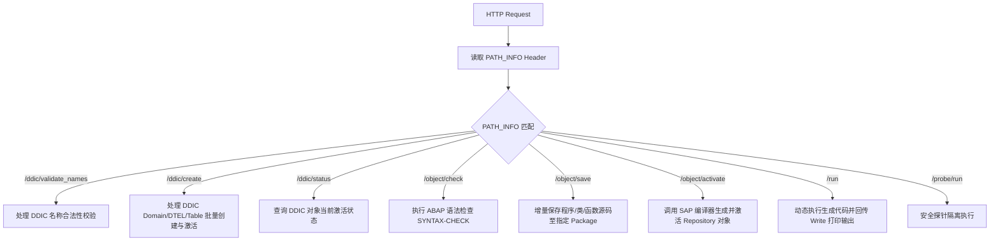

# 02. REST 接口通信与 PATH_INFO 路由调度原理

`sap-ai-mcp-rest-api` 不依赖重型的 RFC/JCo 驱动，而是通过 SAP 原生 SICF 框架暴露 HTTP REST 接口，由 `ZCL_AI_MCP_REST_FUN` 类统一调度。

---

## 路由调度工作原理

HTTP 请求的 Base URL 结构：
`http://<sap-host>:<port>/sap/bc/zai_mcp_rest?sap-client=400`

`ZCL_AI_MCP_REST_FUN` 实现接口 `if_http_extension~handle_request`。它通过读取 HTTP Header 中的 **`PATH_INFO`** 字段来进行路由分发：

---

## 核心端点与 HTTP 方法契约

| 模块类别 | 端点 PATH_INFO | 模式 Mode | 功能说明 |
| :--- | :--- | :--- | :--- |
| **DDIC** | `/ddic/validate_names` | `check` | 预校验命名冲突与保留字 |
| **DDIC** | `/ddic/create` | `write` | 批量创建并激活 Domain, Data Element, Table, Structure |
| **DDIC** | `/ddic/status` | `read` | 检查表及字段的 `active: true` 状态及包分配 |
| **Repository**| `/object/check` | `check` | 触发 SAP 内置语法检查 (`stage: SYNTAX_CHECK`) |
| **Repository**| `/object/save` | `write` | 保存源码至 `$TMP` 或 Workbench 传输号 |
| **Repository**| `/object/activate` | `write` | 编译激活对象 (处理 `R3TR PROG`, `R3TR CLAS` 等) |
| **Execution** | `/run` | `write` | 动态编译并执行探针代码，回传列表输出 |

---

## 认证与 Payload 格式

1. **鉴权方式**：HTTP Basic Authentication (`Authorization: Basic <base64(user:password)>`)
2. **字符集**：`Content-Type: application/json; charset=utf-8`
3. **URL 大小写规范**：ICF 节点服务路径必须严格维持全小写 `/sap/bc/zai_mcp_rest`。
