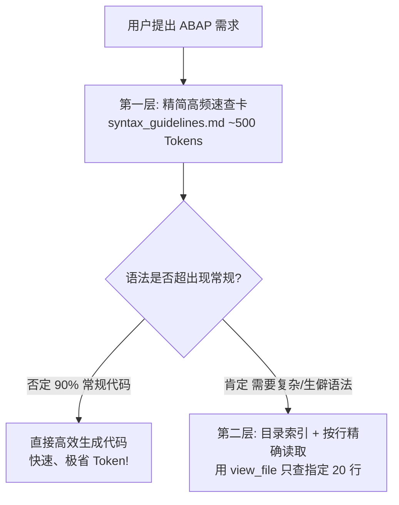

# 06. 高频语法黄金准则与三层按需加载体系 (syntax_guidelines.md)

为了兼顾“语法全面性”与“Context/Token 性能消耗”，系统设计了**三层按需加载体系 (Lazy Loading Architecture)**。

---

## 三层按需加载架构

---

## 第一层：常驻 10 大黄金准则 (Top 10 Golden Rules)

在 [rules/syntax_guidelines.md](file:///c:/Users/37145/Desktop/abap-mcp-api/rules/syntax_guidelines.md) 中常驻（仅约 500 Tokens）：

1. **Host 变量 `@` (新 Open SQL)**：
   * 所有 SQL 语句中的 ABAP 变量/表达式前**必须**加 `@`。
   * 示例：`SELECT ebeln, bukrs FROM ekko INTO TABLE @DATA(lt_po) WHERE ebeln = @iv_ebeln.`
2. **内联声明 (Inline Declarations)**：
   * 变量：`DATA(lv_val) = 'ABC'.`
   * 循环：`LOOP AT lt_items INTO DATA(ls_item).` 或 `ASSIGNING FIELD-SYMBOL(<ls_item>).`
3. **结构与内表赋值 (`VALUE` & `CORRESPONDING`)**：
   * 结构：`ls_data = VALUE #( id = '001' name = 'Zhang' ).`
   * 拷贝：`ls_target = CORRESPONDING #( ls_source ).`
4. **字符串模板 (String Templates)**：
   * 使用 `|Text { lv_var }|` 替代 `CONCATENATE`。
5. **条件表达式 (`COND` & `SWITCH`)**：
   * `DATA(lv_status) = COND string( WHEN sy-subrc = 0 THEN 'Success' ELSE 'Failed' ).`
6. **表表达式 (Table Expressions)**：
   * 读取内表单行：`DATA(ls_row) = lt_list[ id = '100' ].` (包含防护：`VALUE #( lt_list[ id = '100' ] OPTIONAL )`)
7. **布尔函数 (`XSDBOOL`)**：
   * `DATA(lv_is_valid) = xsdbool( sy-subrc = 0 AND lv_count > 0 ).`
8. **显式异常捕获与 `sy-subrc` 校验**：
   * FM/BAPI 调用后**必须**校验 `IF sy-subrc <> 0.`。
9. **强约束标志**：
   * 程序/类必须包含 `FIXPT = 'X'` (固定点算术) 与 `UCCHECK = 'X'` (Unicode 校验)。
10. **废弃语法禁忌 (Forbidden Legacy)**：
    * ❌ 严禁使用 `MOVE`, `COMPUTE`, `TABLES`, `OCCURS 0`, `WITH HEADER LINE`。

---

## 第二/三层：按需索引参考知识库

只有当 AI 遇到复杂语法时，才通过 `view_file` 按行读取：

1. **经典 ABAP 基础语法指南**：[rules/abap_syntax_guide_classic.md](file:///c:/Users/37145/Desktop/abap-mcp-api/rules/abap_syntax_guide_classic.md)（约 7.1 万字，包含基本数据类型、`SY-*` 系统对象、`DESCRIBE` 探针等）。
2. **ABAP 7.5+ / S4HANA 新特性语法指南**：[rules/abap_syntax_guide_s4hana.md](file:///c:/Users/37145/Desktop/abap-mcp-api/rules/abap_syntax_guide_s4hana.md)（约 7.8 万字，包含 `REDUCE`, `GROUP BY`, `FILTER`, `CAST`, `OFFSET` 等高级特性）。
