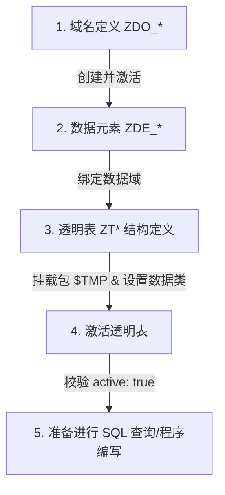

# 09. DDIC 数据字典全生命周期自动化实现 (Domain, Data Element, Table)

数据字典 (DDIC) 是 SAP 开发的基础。`sap-ai-mcp-rest-api` 实现了 Domain ➔ Data Element ➔ Transparent Table 的全自动依赖构建与激活链。

---

## DDIC 依赖构建链与创建顺序

在创建包含自定义字段的透明表时，系统按严格的依赖链路依次创建并激活对象：



---

## 典型 DDIC 创建 Payload 范例 (`/ddic/create`)

```json
{
  "package": "$TMP",
  "transport": "",
  "domains": [
    { "name": "ZDO_ZYH_ID", "data_type": "CHAR", "length": 10, "decimals": 0, "description": "Demo ID Domain" },
    { "name": "ZDO_ZYH_NAME", "data_type": "CHAR", "length": 40, "decimals": 0, "description": "Demo Name Domain" },
    { "name": "ZDO_ZYH_AMT", "data_type": "DEC", "length": 13, "decimals": 2, "description": "Demo Amount Domain" }
  ],
  "data_elements": [
    { "name": "ZDE_ZYH_ID", "domain": "ZDO_ZYH_ID", "description": "Demo ID Data Element", "short_text": "Demo ID", "medium_text": "Demo ID", "long_text": "Demo ID Code", "heading": "ID" },
    { "name": "ZDE_ZYH_NAME", "domain": "ZDO_ZYH_NAME", "description": "Demo Name Data Element", "short_text": "Demo Name", "medium_text": "Demo User Name", "long_text": "Demo User Full Name", "heading": "Name" },
    { "name": "ZDE_ZYH_AMT", "domain": "ZDO_ZYH_AMT", "description": "Demo Amount Data Element", "short_text": "Demo Amt", "medium_text": "Demo Amount", "long_text": "Demo Total Amount", "heading": "Amount" }
  ],
  "tables": [
    {
      "name": "ZTDEMO_ZYH",
      "description": "Demo Table for ZYH",
      "delivery_class": "A",
      "data_maintenance": "X",
      "data_class": "APPL0",
      "size_category": "0",
      "fields": [
        { "name": "MANDT", "data_element": "MANDT", "key_flag": true, "not_null": true, "position": 1 },
        { "name": "DEMO_ID", "data_element": "ZDE_ZYH_ID", "key_flag": true, "not_null": true, "position": 2 },
        { "name": "DEMO_NAME", "data_element": "ZDE_ZYH_NAME", "key_flag": false, "not_null": false, "position": 3 },
        { "name": "DEMO_AMT", "data_element": "ZDE_ZYH_AMT", "key_flag": false, "not_null": false, "position": 4 }
      ]
    }
  ]
}
```

---

## 状态查询与结果响应 (`/ddic/status`)

调用 `/ddic/status` 返回每个 DDIC 对象的真实激活状态与 `TADIR` 挂载包信息：

```json
{
  "status": "OK",
  "results": [
    { "status": "OK", "object_type": "DOMA", "object_name": "ZDO_ZYH_ID", "active": true, "as4local": "A", "message": "Domain is active" },
    { "status": "OK", "object_type": "DTEL", "object_name": "ZDE_ZYH_ID", "active": true, "as4local": "A", "message": "Data element is active" },
    { "status": "OK", "object_type": "TABL", "object_name": "ZTDEMO_ZYH", "active": true, "as4local": "A", "message": "Table is active" }
  ]
}
```
